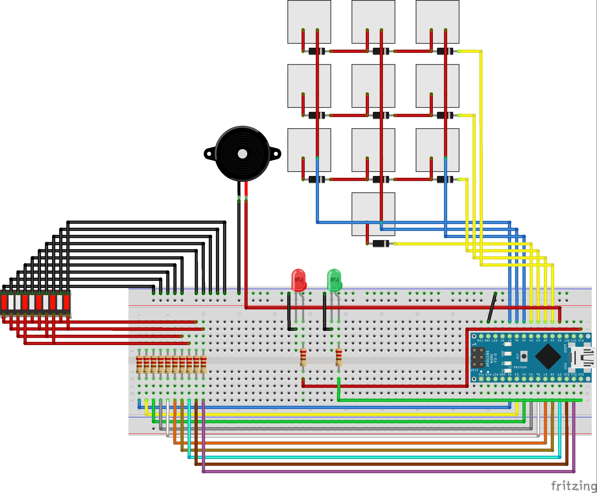

# Ordered Numbers Interaction

The Ordered Numbers Interaction is a mini game that was developed for my Master Thesis "Developing a Support Infrastructure for an Escape The Room and Peddy Paper Games".

This mini game, or interaction as I so call it, was developed to be part of an Escape the Room game that was also developed as part of my thesis. Since this interaction can work as a standalone mini game I decided to place it here for anyone interested in using it.

## List of Components

- LED Bar Graph (1x);
- Mechanical Switch (10x);
- Diode 1n4148 (10x);
- Red LED (1x);
- Green LED (1x);
- 220Ω Resistor (12x);
- Piezzo Speaker (1x);
- Arduino Nano (1x);

In order to fully assemble the Interaction, so as to look like the picture below, you will also need to 3D Print the enclosure which is divided into two parts that can be found [here](enclosure/). Additionally, you will also need to 3D Print the keycaps which **were not** designed by me but can be found in [Thingiverse](https://www.thingiverse.com/thing:2783650).

## The Purpose of The Game

The Ordered Numbers Interaction, even though it was designed to be played as part of an Escape The Room, is an interaction that can also be played as a standalone mini game.

The way this mini game works is that it shuffles the mapping of the keyboard so that the numbers that are written on the plate above each keycap do not correspond to that keycap and instead correspond to another one. 

In order to win at this mini game the player must, through trial and error, try to press the numbers from 0 all the way to 9. As the player presses the keys a bar in the LED bar graph will light up which corresponds to the number of the pressed key. 

Once the player presses all the keys in the correct order the green LED will light up and the LED bar graph will also play a sequence symbolizing that the player has completed the game.

## Instructions

First start by uploading the code to your Arduino Nano (This is the one I used so I can only guarantee proper working with this micro-controller).

### Starting The Game

To start the game you must first type in the Arduino IDE serial monitor the following:

- > COM:START;ID:123456789

This command will then print in the Serial Monitor the mapping of the keys which is the keys that need to be pressed. Once the correct sequence of keys is pressed the following message will appear in the serial monitor:

- > COM:INTERACTION_SOLVED;MSG:User Ordered Numbers Correctly;PNT:1250

## Warning

The source code for this interaction contains a lot of logic that was made to communicate with the infrastructure that was developed for my thesis and therefor it is not as clean as it could be when compared to a mini game that is developed with the intent of being used by the Arduino IDE directly.